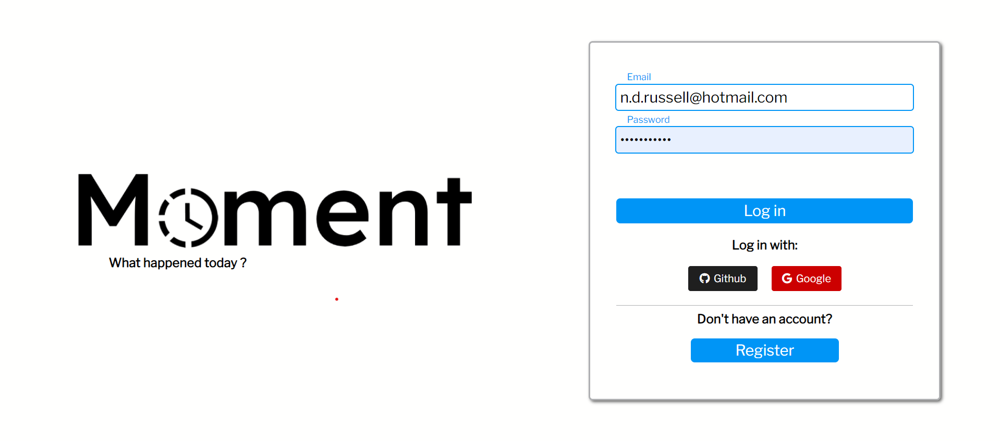
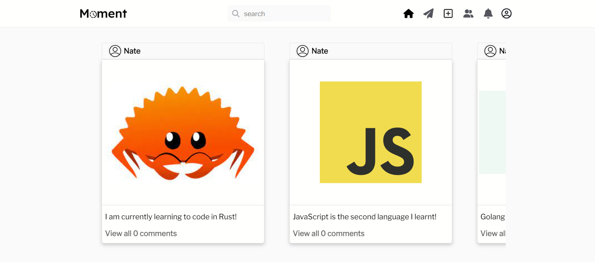

## Facebook Clone

### Moment 

A social media website taking inspiration from Instagram and Facebook, built with React, Golang, Docker, SQLite3, and CSS.

## Installation and Setup Instructions

You will need `node`, `npm` and `Docker` installed globally on your machine.

A Dockerfile has been made for both the frontend and backend. 

There is also a makefile that has commands to build both docker images.

Before building the docker images you must ensure that docker is installed and running on your machine.

#### Frontend
To build the frontend docker image:
1) Open a terminal for the directory `facebook-clone`
2) run the command `make frontendDocker`

#### Backend
To build the backend docker image:
1) Open a terminal for the directory `facebook-clone`
2) run the command `make backendDocker`

Once both images are created and running go to [localhost:8070](http://localhost:8070)

This project was a project for the 01 Founders coding school and was completed with [codecplyre](https://github.com/codecplyre) & [Keivon](https://github.com/Keivon)
